# ContiNew Admin - 项目评审管理系统

> AI 上下文文档 | 最后更新：2026-01-16 11:48:58

---

## 变更记录 (Changelog)

### 2026-01-16 11:48:58
- 初始化项目 AI 上下文文档
- 生成模块结构图与索引
- 完成前后端模块扫描与文档生成

---

## 项目愿景

ContiNew Admin（Continue New Admin）是一个持续迭代优化的前后端分离中后台管理系统框架，旨在提供开箱即用、舒适的开发体验。本项目基于 **ContiNew Starter**（一套企业级 Spring Boot 增强工具集），集成了仪表盘、系统管理、系统监控、租户管理、能力开放、任务调度等多个核心模块。

### 核心特性

- **前后端分离架构**：前端基于 Vue 3 + Arco Design，后端基于 Spring Boot + MyBatis Plus
- **多租户支持**：内置行级租户隔离能力，支持租户套餐与菜单权限配置
- **任务调度**：集成任务调度服务器，支持分布式任务执行
- **能力开放**：提供应用管理与接口开放能力
- **代码生成器**：支持根据数据库表自动生成前后端代码
- **完善的权限体系**：基于 Sa-Token 实现细粒度的权限控制
- **丰富的监控工具**：包含在线用户监控、操作日志、登录日志、短信日志等

---

## 架构总览

### 技术栈

**后端核心技术**
- Spring Boot 3.x（基于 ContiNew Starter 2.15.0）
- MyBatis Plus（数据持久层）
- Sa-Token（认证授权）
- Redisson（分布式缓存与锁）
- JetCache（本地+远程二级缓存）
- X-File-Storage（文件存储抽象）
- PowerJob（任务调度）

**前端核心技术**
- Vue 3.5.x
- TypeScript 5.0.x
- Vite 5.x
- Arco Design 2.57.x
- Pinia（状态管理）
- Vue Router 4.x
- ECharts（数据可视化）

### 架构分层

```
┌─────────────────────────────────────────────────────┐
│                   前端展示层 (UI)                     │
│        continew-admin-ui (Vue 3 + Arco Design)       │
└─────────────────────────────────────────────────────┘
                          ▼
┌─────────────────────────────────────────────────────┐
│                   后端服务层 (API)                    │
│         continew-server (Spring Boot 应用)           │
└─────────────────────────────────────────────────────┘
                          ▼
┌─────────────────────────────────────────────────────┐
│              业务模块层 (Business Modules)             │
│  ┌──────────────┐ ┌──────────────┐ ┌─────────────┐  │
│  │ continew-    │ │ continew-    │ │ continew-   │  │
│  │ system       │ │ plugin       │ │ extension   │  │
│  └──────────────┘ └──────────────┘ └─────────────┘  │
└─────────────────────────────────────────────────────┘
                          ▼
┌─────────────────────────────────────────────────────┐
│               基础能力层 (Infrastructure)              │
│         continew-starter (企业级 Starter 集合)        │
└─────────────────────────────────────────────────────┘
```

---

## 模块结构图

```mermaid
graph TD
    A["(根) ContiNew Admin"] --> B["continew-admin (后端主项目)"];
    A --> C["continew-admin-ui (前端项目)"];
    A --> D["continew-starter (基础增强库)"];

    B --> B1["continew-server (启动入口)"];
    B --> B2["continew-system (系统管理)"];
    B --> B3["continew-plugin (插件模块)"];
    B --> B4["continew-common (公共模块)"];
    B --> B5["continew-extension (扩展模块)"];

    B3 --> B31["continew-plugin-generator (代码生成器)"];
    B3 --> B32["continew-plugin-open (能力开放)"];
    B3 --> B33["continew-plugin-schedule (任务调度)"];
    B3 --> B34["continew-plugin-tenant (租户管理)"];

    B5 --> B51["continew-extension-schedule-server (调度服务器)"];

    D --> D1["continew-starter-core (核心工具)"];
    D --> D2["continew-starter-web (Web 增强)"];
    D --> D3["continew-starter-data (数据访问)"];
    D --> D4["continew-starter-auth (认证授权)"];
    D --> D5["continew-starter-cache (缓存)"];
    D --> D6["continew-starter-log (日志)"];
    D --> D7["continew-starter-storage (文件存储)"];
    D --> D8["...更多 Starter 模块"];

    C --> C1["src/views (页面视图)"];
    C --> C2["src/components (组件)"];
    C --> C3["src/router (路由)"];
    C --> C4["src/stores (状态管理)"];

    click B1 "./continew-admin/continew-server/CLAUDE.md" "查看 continew-server 模块文档"
    click B2 "./continew-admin/continew-system/CLAUDE.md" "查看 continew-system 模块文档"
    click B3 "./continew-admin/continew-plugin/CLAUDE.md" "查看 continew-plugin 模块文档"
    click B4 "./continew-admin/continew-common/CLAUDE.md" "查看 continew-common 模块文档"
    click B5 "./continew-admin/continew-extension/CLAUDE.md" "查看 continew-extension 模块文档"
    click C "./continew-admin-ui/CLAUDE.md" "查看前端项目文档"
    click D "./continew-starter/CLAUDE.md" "查看 ContiNew Starter 文档"
```



---

## 模块索引

| 模块路径 | 职责描述 | 语言 | 文档链接 |
|---------|---------|------|---------|
| **continew-admin** | 后端主项目，聚合所有后端模块 | Java 17 | [查看](./continew-admin/CLAUDE.md) |
| ├─ continew-server | Spring Boot 启动入口，Controller 层，打包部署模块 | Java | [查看](./continew-admin/continew-server/CLAUDE.md) |
| ├─ continew-system | 系统管理核心模块（用户、角色、菜单、部门、日志等） | Java | [查看](./continew-admin/continew-system/CLAUDE.md) |
| ├─ continew-plugin | 插件模块集合（代码生成、租户、任务调度、能力开放） | Java | [查看](./continew-admin/continew-plugin/CLAUDE.md) |
| ├─ continew-common | 公共模块（工具类、全局配置、异常处理） | Java | [查看](./continew-admin/continew-common/CLAUDE.md) |
| └─ continew-extension | 扩展模块（任务调度服务器等） | Java | [查看](./continew-admin/continew-extension/CLAUDE.md) |
| **continew-admin-ui** | 前端 UI 项目，Vue 3 + Arco Design | TypeScript | [查看](./continew-admin-ui/CLAUDE.md) |
| **continew-starter** | 企业级 Spring Boot Starter 集合，提供开箱即用的基础能力 | Java | [查看](./continew-starter/CLAUDE.md) |

---

## 运行与开发

### 环境要求

**后端**
- JDK 17+
- Maven 3.8+
- MySQL 8.0+ 或 PostgreSQL 13+
- Redis 6.0+

**前端**
- Node.js 18+
- pnpm 8+

### 快速启动

#### 后端启动

```bash
# 1. 克隆仓库
cd continew-admin

# 2. 导入数据库（执行 db/init.sql）

# 3. 修改配置文件
# 编辑 continew-admin/continew-server/src/main/resources/config/application-dev.yml
# 配置数据库、Redis 连接信息

# 4. 启动主应用
cd continew-server
mvn spring-boot:run
```

访问接口文档：http://localhost:8000/doc.html

#### 前端启动

```bash
# 1. 进入前端目录
cd continew-admin-ui

# 2. 安装依赖
pnpm install

# 3. 启动开发服务器
pnpm dev
```

访问前端页面：http://localhost:5173

#### 任务调度服务器启动（可选）

```bash
cd continew-admin/continew-extension/continew-extension-schedule-server
mvn spring-boot:run
```

### 开发流程

1. **后端开发**：在 `continew-admin/continew-system` 或相应插件模块中编写业务逻辑
2. **前端开发**：在 `continew-admin-ui/src/views` 中编写页面，API 调用通过 `src/api` 定义
3. **代码生成**：使用内置代码生成器快速生成增删改查模板代码
4. **联调测试**：前端通过 Vite 代理访问后端接口（配置见 `vite.config.ts`）

---

## 测试策略

### 后端测试

- **单元测试**：当前项目跳过单元测试（`maven-surefire-plugin` 配置 `skip=true`）
- **集成测试**：提供 `ContiNewAdminApplicationTests` 作为启动测试入口
- **API 测试**：通过 Swagger/Knife4j 接口文档进行手工测试

### 前端测试

- **类型检查**：`pnpm typecheck` 执行 TypeScript 类型检查
- **代码检查**：`pnpm lint` 执行 ESLint 检查
- **自动修复**：`pnpm lint:fix` 自动修复代码风格问题

---

## 编码规范

### 后端规范

- **代码格式**：使用 Spotless + P3C 代码风格（阿里巴巴 Java 开发手册）
- **注释规范**：所有公共方法需提供 Javadoc 注释，包含 `@author` 和 `@since`
- **包结构**：
  - `controller`：控制器层
  - `service`：业务逻辑层
  - `mapper`：数据访问层
  - `model`：实体与 DTO
  - `enums`：枚举定义
  - `config`：配置类
- **异常处理**：统一使用 `BusinessException`、`BadRequestException` 等自定义异常
- **日志规范**：使用 Slf4j，避免直接使用 `System.out.println`

### 前端规范

- **代码格式**：遵循 `@antfu/eslint-config` 规范
- **组件命名**：使用 PascalCase（大驼峰）
- **文件命名**：
  - 组件文件：`ComponentName.vue`
  - 工具文件：`utils.ts`
  - API 文件：`module.ts`
- **状态管理**：使用 Pinia，按模块拆分 Store
- **类型定义**：所有 API 请求与响应需定义 TypeScript 接口

---

## AI 使用指引

### 提问建议

当您需要 AI 帮助时，请遵循以下建议以获得更精准的回答：

1. **明确模块**：指明问题涉及的模块（如"在 continew-system 模块中如何..."）
2. **提供上下文**：说明您想实现的功能或遇到的问题
3. **引用文件路径**：使用绝对路径或相对路径引用具体文件
4. **指定技术栈**：如果涉及特定技术，请说明（如"使用 MyBatis Plus 如何..."）

### 常见任务示例

- **添加新功能**："在 continew-system 模块中添加新的用户导出功能，需要生成 Excel 文件"
- **修复问题**："continew-admin-ui 中的用户列表页面分页参数传递不正确，如何修复？"
- **代码优化**："优化 continew-server 启动类的配置加载逻辑"
- **理解代码**："解释 continew-starter-auth-satoken 模块中的 JWT 认证流程"

### 文档更新

当您对项目进行重大修改后，建议运行 AI 上下文更新命令，以保持文档与代码同步：

```bash
# 使用 Claude Code 更新文档
claude init --timestamp "$(date -Iseconds)"
```

---

## 相关链接

- **项目地址**：https://github.com/continew-org/continew-admin
- **在线文档**：https://continew.top/docs/admin/
- **常见问题**：https://continew.top/docs/admin/faq.html
- **更新日志**：https://continew.top/docs/admin/changelog/
- **吐槽广场**：https://continew.top/docs/admin/issue-hub.html
- **ContiNew Starter**：https://github.com/continew-org/continew-starter

---

## 项目信息

- **当前版本**：4.2.0-SNAPSHOT
- **ContiNew Starter 版本**：2.15.0
- **作者**：zjx (3079870363@qq.com)
- **许可证**：Apache License 2.0

---

*此文档由 AI 自动生成并维护，如有问题请反馈至项目维护者。*
